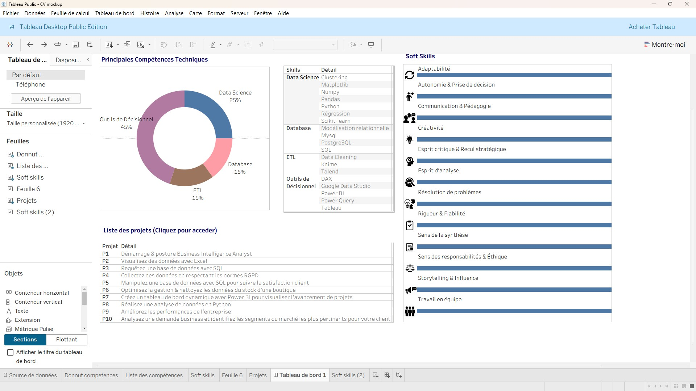

# 📊 Portfolio Business Intelligence & Data Analysis

Bienvenue sur mon portfolio de projets en **Business Intelligence, Data Analytics et Data Science**.  
Vous trouverez ici une sélection de projets issus de mon parcours de formation et d’expériences pratiques, allant de la **visualisation de données** à la **modélisation prédictive en Python**, en passant par la **gestion de bases de données SQL** et l’**industrialisation avec Knime et Power BI**.

---

## 🚀 Projets

### [Projet 1 – Démarrage & posture BI Analyst](./Projet%2001%20–%20Démarrage%20&%20posture%20BI%20Analyst/)  
Fiche de formation, découverte du métier, auto-évaluation des soft skills.  
 **Compétences :** organisation, définition d’objectifs, collaboration mentorale.  

---

### [Projet 2 – Visualisation des données avec Excel](./Projet%2002%20–%20Visualisation%20des%20donn%C3%A9es%20avec%20Excel/)  
📌 Analyse des départs clients de Primero Bank avec tableaux croisés dynamiques et graphiques.  
🎯 **Compétences :** data visualisation, accessibilité, communication non-technique.  

---

### [Projet 3 – Requêtes SQL et création de BDD](./Projet%2003%20–%20Requ%C3%AAtes%20SQL%20et%20cr%C3%A9ation%20de%20BDD/)  
📌 Création d’une base relationnelle, requêtes SQL, normalisation 3NF.  
🎯 **Compétences :** modélisation, gestion BDD, rédaction requêtes SQL.  

---

### [Projet 4 – Collecte & anonymisation RGPD](./Projet%2004%20–%20Collecte%20%26%20anonymisation%20RGPD/)  
📌 Mission Dev’Immediat : extraction SQL, anonymisation Power Query, recommandations RGPD.  
🎯 **Compétences :** RGPD, nettoyage, documentation technique, reporting.  

---

### [Projet 5 – SQL & Satisfaction client](./Projet%2005%20–%20SQL%20%26%20Satisfaction%20client/)  
📌 Mission RetailInsight360 : requêtes SQL avancées, analyse satisfaction & cohérence.  
🎯 **Compétences :** gestion BDD, requêtes analytiques, documentation technique.  

---

### [Projet 6 – Optimisez la gestion & nettoyez les données du stock d'une boutique](./Projet%2006%20–%20Optimisez%20la%20gestion%20%26%20nettoyez%20les%20donn%C3%A9es%20du%20stock%20d%27une%20boutique/)  
📌 Nettoyage et rapprochement ERP + site e-commerce, analyses CA/marge, corrélations.  
🎯 **Compétences :** Python/R, nettoyage avancé, analyses univariées/multivariées.  

---

### [Projet 7 – Tableau de bord Power BI-visualiser l'avancement de projets](./Projet%2007%20–%20Tableau%20de%20bord%20Power%20BI-visualiser%20l%27avancement%20de%20projets/)  
📌 Construction d’un tableau de bord interactif pour le suivi de projets.  
🎯 **Compétences :** Power Query, DAX, user stories, storytelling visuel.  

---

### [Projet 8 – Analyse de données en Python (Immobilier Paris)](./Projet%2008%20–%20Analyse%20de%20donn%C3%A9es%20en%20Python%20%28Immobilier%20Paris%29/)  
📌 Séries temporelles, corrélations, régression linéaire, clustering K-means.  
🎯 **Compétences :** Pandas, Matplotlib, Machine Learning (sklearn).  

---

### [Projet 9 – Améliorez les performances de l'entreprise](./Projet%2009%20–%20Am%C3%A9liorez%20les%20performances%20de%20l%27entreprise/)  
📌 Workflow **Knime** + Power BI Services, recommandations business.  
🎯 **Compétences :** ETL, automatisation, modèle sémantique Power BI, KPI stratégiques.  

---

### [Projet 10 – Analysez une demande business identifiez les segments du marché les plus pertinents pour votre client](./Projet%2010%20–%20Analysez%20une%20demande%20business%20identifiez%20les%20segments%20du%20march%C3%A9%20les%20plus%20pertinents%20pour%20votre%20client/)  
📌 Analyse SWOT/PESTEL, tendances, enquête utilisateurs, recommandations de segment.  
🎯 **Compétences :** analyse stratégique, data storytelling, recommandations business.  

---

## 📂 Organisation du portfolio
Chaque projet est disponible dans un **dossier GitHub dédié** avec :  
- Le **contexte** et les **objectifs** du projet  
- Les **sources de données** utilisées (si publiques)  
- Les **notebooks, scripts SQL, dashboards Power BI/Tableau**  
- La **documentation** et les **présentations associées**  

---

## Livrables du Projet

  <table>
    <tr>
      <td align="center" width="50%">
        <h3>🎥 Vidéo de formation à Tableau Public</h3>
        
Cliquez ci-dessous pour accéder à la vidéo sur Loom. 
        (Version MP4 également disponible dans le répertoire <code>Livrables</code>.)

        
        

          
Détails de la vidéo

          
Dans cette vidéo (22 min), je vous montre pas à pas comment créer deux graphiques avancés avec <strong>Tableau Public</strong> :

          <ul>
            <li><strong>Un graphique en donut</strong> (avec champ calculé pour normalisation à 100 %)</li>
            <li><strong>Un graphique de compétences (soft skills)</strong> avec icônes, texte et barres de progression</li>
          </ul>
          
Cette démonstration couvre :

          <ul>
            <li>Le chargement et la préparation des données</li>
            <li>La construction des graphiques étape par étape</li>
            <li>Les ajustements visuels pour un rendu clair et esthétique</li>
            <li>Les bonnes pratiques de mise en page dans un tableau de bord</li>
          </ul>
        

      </td>
      <td align="center" width="50%">
        <h3>📊 Dashboards interactifs</h3>
        
Cliquez ci-dessous pour voir les deux dashboards publiés sur Tableau Public. 
        (Copies également disponibles dans le répertoire <code>Livrables</code>.)

        
      </td>
    </tr>
  </table>

## 📬 Contact
💼 LinkedIn : [[Cliquez](https://www.linkedin.com/in/julien-liodenot/)](#)  
📧 Email : [julien.liodenot@dataexec.fr](#)  

Merci d’avoir consulté mon portfolio ! 🙌  
N’hésitez pas à me contacter pour échanger autour de la **data**, de la **BI** ou de futures **collaborations**.

---
©2025 Julien Liodenot – Tous droits réservés.
